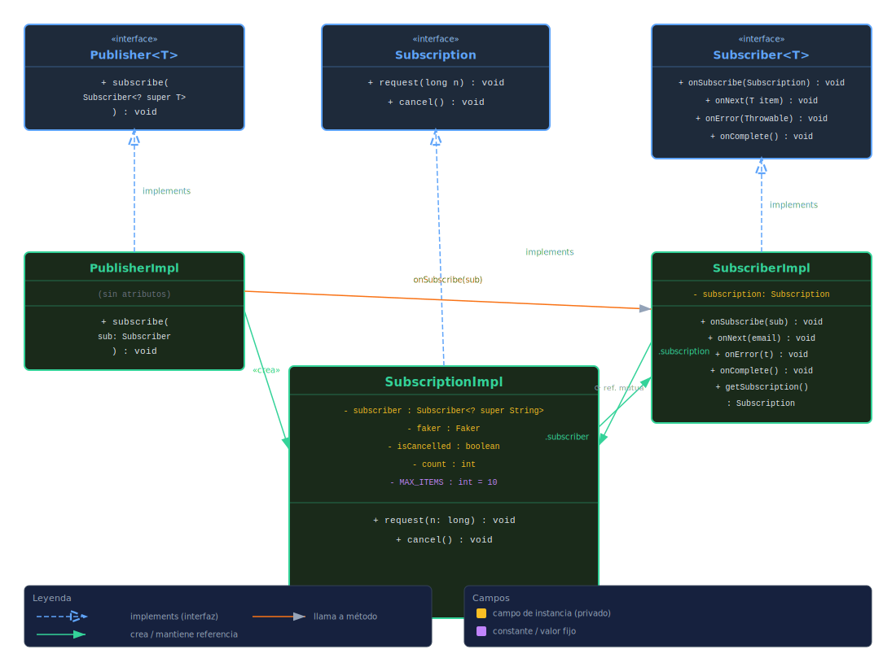

# Sección 01 — Implementación Custom de Publisher-Subscriber

## Objetivo

Esta sección implementa el patrón **Publisher-Subscriber** desde cero, siguiendo la especificación **Reactive Streams**, sin usar ninguna librería de alto nivel como Project Reactor. El objetivo es entender cómo funciona internamente el modelo reactivo antes de usarlo.

---

## Diagrama de Clases



> El diagrama muestra las interfaces de Reactive Streams (`Publisher`, `Subscriber`, `Subscription`) en azul, las clases concretas en verde, los campos de instancia en amarillo y las constantes en violeta.

---

## Componentes Creados

### `PublisherImpl`

Implementa la interfaz `Publisher<String>` de la especificación Reactive Streams. Su responsabilidad es **única y simple**: cuando un suscriptor llama a `subscribe()`, instanciar una `SubscriptionImpl` pasándole la referencia al suscriptor, y luego notificar al suscriptor llamando a `subscriber.onSubscribe(subscription)`.

```java
public void subscribe(Subscriber<? super String> subscriber) {
    var subscription = new SubscriptionImpl(subscriber);
    subscriber.onSubscribe(subscription);
}
```

**No produce ningún dato por sí solo.** Es solo el punto de entrada al sistema reactivo. La lógica de producción vive íntegramente en `SubscriptionImpl`.

---

### `SubscriptionImpl`

El núcleo de este sistema. Implementa la interfaz `Subscription` y es quien **realmente produce y envía los datos** al suscriptor. Mantiene el estado de la relación uno a uno entre el publisher y el subscriber.

**Estado interno:**
- `subscriber` — referencia al suscriptor al que se le envían los datos
- `faker` — generador de datos falsos (simula emails reales)
- `isCancelled` — flag que indica si la suscripción fue cancelada
- `count` — cantidad de items ya emitidos (límite: 10)
- `MAX_ITEMS = 10` — cantidad máxima de items que este publisher puede producir

**Lógica de `request(n)`:**
1. Si la suscripción está cancelada → retorna inmediatamente sin hacer nada
2. Si `n > 10` → llama a `subscriber.onError()` y marca como cancelado
3. De lo contrario → genera hasta `n` emails (sin superar el límite total de 10) llamando a `subscriber.onNext()` por cada uno
4. Si se alcanzó el límite total (`count == 10`) → llama a `subscriber.onComplete()` y marca como cancelado

**Lógica de `cancel()`:**
- Simplemente pone `isCancelled = true`; las llamadas futuras a `request()` serán ignoradas

---

### `SubscriberImpl`

Implementa la interfaz `Subscriber<String>`. Su rol es **recibir y reaccionar** a los eventos del publisher. Expone la `Subscription` mediante `getSubscription()` para que el código externo (la clase `Demo`) pueda llamar a `request()` y `cancel()` manualmente.

**Métodos implementados:**
| Método | Comportamiento |
|--------|---------------|
| `onSubscribe(sub)` | Almacena la `Subscription` recibida para uso posterior |
| `onNext(email)` | Loggea el email recibido (simula procesamiento del dato) |
| `onError(t)` | Loggea el error recibido |
| `onComplete()` | Loggea que el flujo finalizó correctamente |
| `getSubscription()` | Retorna la `Subscription` almacenada para llamar `request()`/`cancel()` |

### `Demo`
Contiene cuatro ejemplos que demuestran el comportamiento del sistema:

| Método   | Qué demuestra |
|----------|---------------|
| `demo1()` | Suscripción sin pedir datos — el publisher no hace nada |
| `demo2()` | Múltiples `request()` en distintos momentos, con pausa entre ellos |
| `demo3()` | Cancelación de suscripción — las solicitudes posteriores son ignoradas |
| `demo4()` | Solicitar más de 10 items en un `request(11)` — el publisher envía `onError()` |

---

## Reglas que se demuestran

1. **El publisher no produce datos a menos que el subscriber los solicite.**  
   El publisher solo crea la suscripción. La producción de datos comienza solo cuando se llama a `request()`.

2. **El publisher produce solo `≤` items solicitados.**  
   Si se piden 3 y hay 10 disponibles, solo se envían 3.

3. **El subscriber puede cancelar la suscripción.**  
   Una vez cancelado, las siguientes llamadas a `request()` son ignoradas.

4. **El producer puede enviar señal de error.**  
   Si se solicita más de 10 items, el publisher llama a `onError()` y detiene todo.

---

## Flujo de comunicación

Los diagramas a continuación muestran la secuencia de mensajes entre los actores. La fase de *setup* es común a todos los demos; los escenarios siguientes son alternativos entre sí.

---

### Setup — Fase de suscripción

```
  SubscriberImpl        PublisherImpl        SubscriptionImpl
       │                     │                     │
       │  subscribe(this)    │                     │
       │────────────────────►│                     │
       │                     │  new SubscriptionImpl(subscriber)
       │                     │────────────────────►│
       │                     │               guarda this.subscriber ← (SubscriptionImpl.subscriber)
       │◄──onSubscribe(sub)──│                     │
       │ guarda this.subscription ← (SubscriberImpl.subscription)
       │                     │                     │
       │◄════════════ referencia circular ══════════►
       │  SubscriberImpl.subscription ────────────►│  (apunta a SubscriptionImpl)
       │◄──────────────────────────────────────────│  SubscriptionImpl.subscriber (apunta a SubscriberImpl)
```

> ⚠️ **Referencia circular:** al finalizar el setup, `SubscriberImpl` tiene una referencia a `SubscriptionImpl` (campo `subscription`) y, al mismo tiempo, `SubscriptionImpl` tiene una referencia a `SubscriberImpl` (campo `subscriber`). Ambas instancias se conocen mutuamente.

---

### Demo 2 — Happy path: datos agotados naturalmente

```
  SubscriberImpl        SubscriptionImpl
       │                      │
       │──request(3)─────────►│  isCancelled? → NO  /  n=3 > 10? → NO
       │◄──onNext("email1")───│  count = 1
       │◄──onNext("email2")───│  count = 2
       │◄──onNext("email3")───│  count = 3  (< MAX_ITEMS, no se completa aún)
       │                      │
       │──request(7)─────────►│  isCancelled? → NO  /  n=7 > 10? → NO
       │◄──onNext("email4")───│  count = 4
       │◄──onNext("email5")───│  count = 5
       │◄──onNext("email6")───│  count = 6
       │◄──onNext("email7")───│  count = 7
       │◄──onNext("email8")───│  count = 8
       │◄──onNext("email9")───│  count = 9
       │◄──onNext("email10")──│  count = 10 == MAX_ITEMS
       │◄──onComplete()───────│  isCancelled = true  →  fin del stream
```

---

### Demo 3 — Cancelación de suscripción

```
  SubscriberImpl        SubscriptionImpl
       │                      │
       │──request(2)─────────►│  isCancelled? → NO
       │◄──onNext("email1")───│  count = 1
       │◄──onNext("email2")───│  count = 2
       │                      │
       │──cancel()───────────►│  isCancelled = true
       │                      │
       │──request(2)─────────►│  isCancelled? → SÍ  →  retorna sin efecto
```

---

### Demo 4 — Error: `request(n)` supera el límite

```
  SubscriberImpl        SubscriptionImpl
       │                      │
       │──request(11)────────►│  isCancelled? → NO
       │                      │  n=11 > MAX_ITEMS=10  →  ERROR
       │◄──onError(RuntimeException)   isCancelled = true  →  fin del stream
```

---

**Protocolo reactivo en resumen:**

| Paso | Actor | Acción |
|------|-------|--------|
| 1 | `SubscriberImpl` | Llama a `publisher.subscribe(this)` |
| 2 | `PublisherImpl` | Crea `SubscriptionImpl(subscriber)` y llama a `subscriber.onSubscribe(sub)` |
| 3 | `SubscriberImpl` | Guarda `sub` y llama a `sub.request(n)` cuando está listo |
| 4 | `SubscriptionImpl` | Genera y envía hasta `n` items vía `subscriber.onNext(item)` |
| 5a | `SubscriptionImpl` | Si los datos se agotaron → llama a `subscriber.onComplete()` |
| 5b | `SubscriptionImpl` | Si `n > 10` → llama a `subscriber.onError(exception)` |
| 5c | `SubscriberImpl` | Si ya no necesita datos → llama a `subscription.cancel()` |

---

## Conceptos clave que introduce esta sección

- **Evaluación perezosa (Lazy Evaluation):** el publisher no hace nada hasta que se solicita.
- **Backpressure básico:** el suscriptor controla cuántos items recibe con `request(n)`.
- **Ciclo de vida reactivo:** `onSubscribe → onNext* → (onComplete | onError)`.
- **Cancelación:** el suscriptor puede interrumpir la producción en cualquier momento.

> Esta sección es la base conceptual de todo lo que se verá en las secciones siguientes con Project Reactor.
